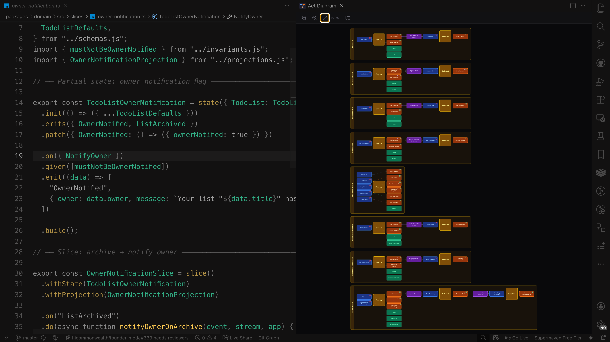

# Act Diagram for VS Code

Visualize your [@rotorsoft/act](https://github.com/Rotorsoft/act-root) event-sourcing domain models as interactive diagrams, right inside VS Code.

## Features

### Live Domain Model Visualization

See your entire Act architecture at a glance — states, actions, events, reactions, projections, and slices — rendered as an interactive diagram in a side panel.

### Real-Time Updates

The diagram updates automatically as you edit your TypeScript files. No need to save or refresh — changes appear instantly.

### Click-to-Navigate

Click any element in the diagram to jump directly to its definition in your source code:
- **States** — opens the `state()` declaration
- **Actions** — jumps to the `.on()` definition
- **Events** — navigates to the `.emits()` declaration
- **Reactions** — finds the `.do()` handler
- **Projections** — locates the `projection()` builder
- **Guards** — highlights the invariant definition

### TypeScript Error Overlay

TypeScript errors from VS Code's language service are forwarded to the diagram. Slices with errors are visually marked, helping you spot issues in context.

### Multi-Tab Navigation

When your project has multiple `act()` orchestrators, the diagram shows tabs for each entry point so you can switch between different domain contexts.

## Getting Started

1. Install the extension from the VS Code Marketplace
2. Open a workspace containing Act framework definitions (`.ts` / `.tsx` files)
3. Open the command palette: **Cmd+Shift+P** (macOS) or **Ctrl+Shift+P** (Windows/Linux)
4. Run `Act: Open Diagram`
5. The diagram panel opens on the right side of your editor

## Commands

| Command | Description |
|---------|-------------|
| `Act: Open Diagram` | Open the Act diagram panel |

## Requirements

- VS Code 1.100.0 or later
- A workspace with [@rotorsoft/act](https://www.npmjs.com/package/@rotorsoft/act) TypeScript definitions

## How It Works

The extension scans your workspace for `.ts` and `.tsx` files, transpiles them using [Sucrase](https://github.com/alangpierce/sucrase), and evaluates them against mock Act builders to extract the domain model structure — all locally, without running your application code.

The extracted model is rendered as an interactive SVG diagram with pan, zoom, and click navigation.

## Related

- [@rotorsoft/act](https://github.com/Rotorsoft/act-root) — The Act event-sourcing framework
- [@rotorsoft/act-diagram](https://www.npmjs.com/package/@rotorsoft/act-diagram) — The diagram extraction and rendering library
- [act-nvim](https://github.com/Rotorsoft/act-nvim) — Act diagrams for Neovim

## Contributing

See the [GitHub repository](https://github.com/Rotorsoft/act-vscode) for development setup and contribution guidelines.

## License

[MIT](LICENSE)
